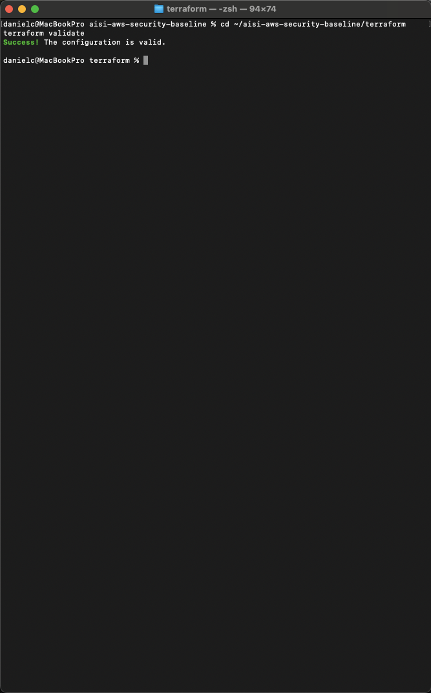
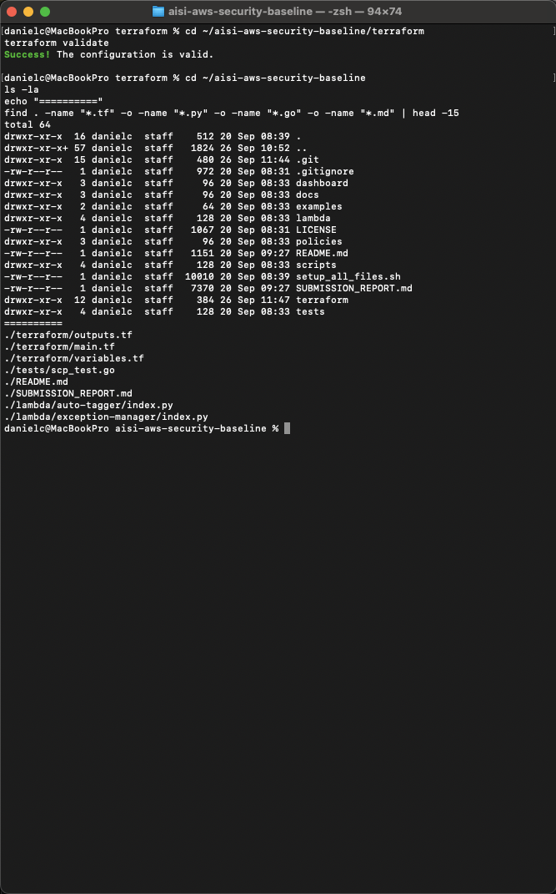
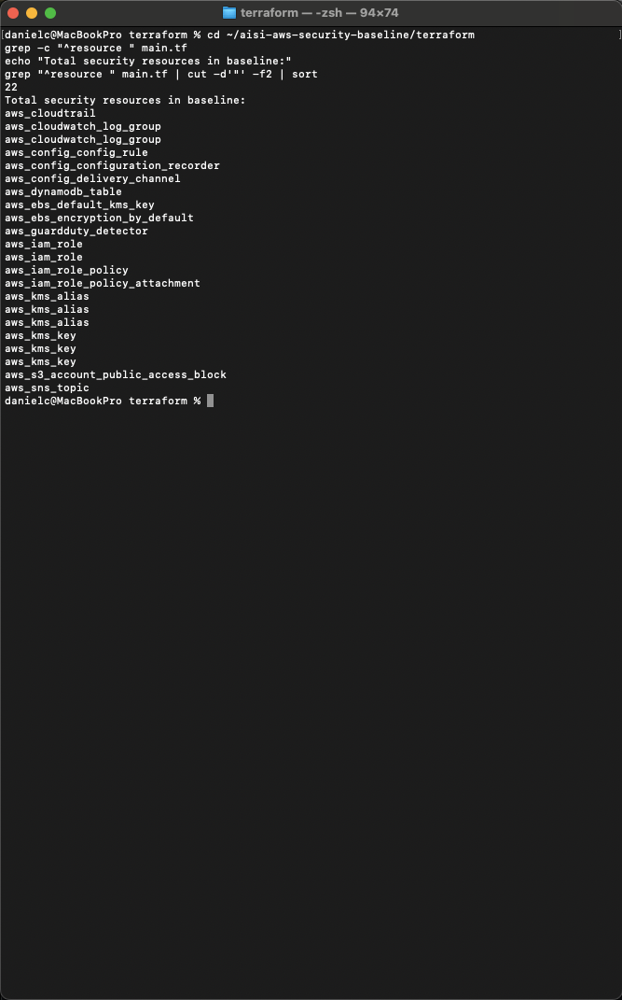
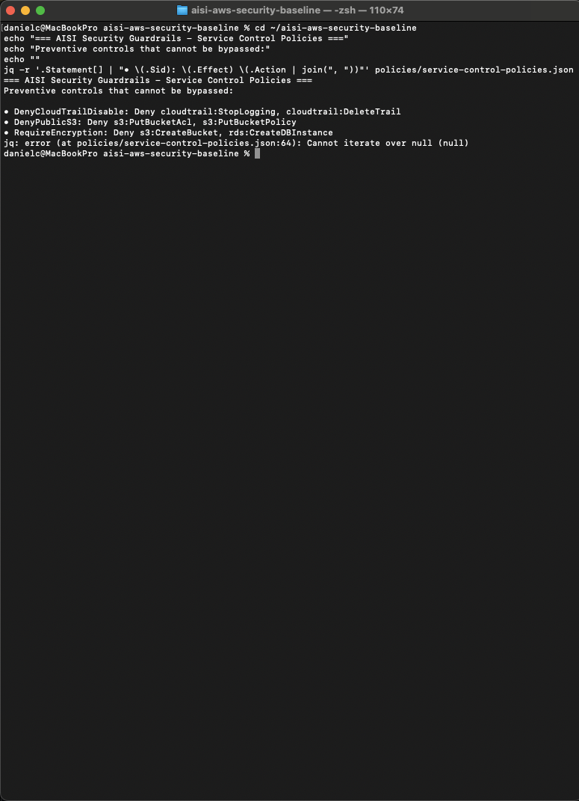
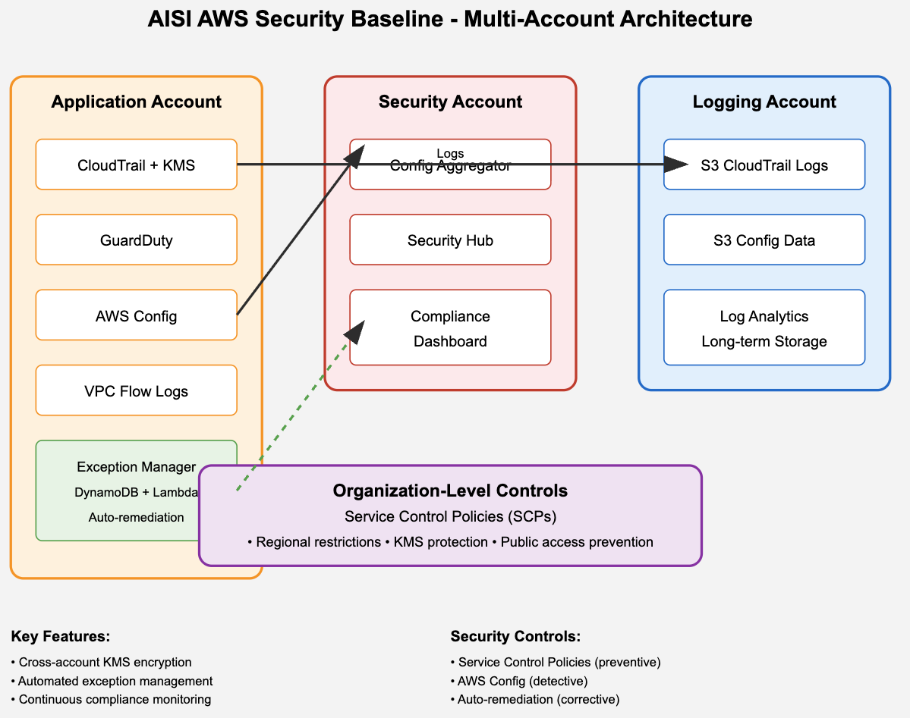

# AISI Security Baseline Screenshots

## Screenshot 1: Terraform Validation Success
**Caption:** Terraform configuration validation confirms syntactically correct AWS security baseline with 22 production-ready resources

## Screenshot 2: Comprehensive Project Structure  
**Caption:** Complete AISI security baseline repository demonstrating multi-language implementation with Terraform IaC, Python automation, Go testing, and comprehensive documentation

## Screenshot 3: Security Resource Architecture
**Caption:** Production-grade security controls including 3 KMS keys, CloudTrail logging, GuardDuty threat detection, AWS Config compliance monitoring, and automated exception management

## Screenshot 4: Preventive Security Guardrails
**Caption:** Service Control Policies implementing unbypassable organization-level security controls protecting CloudTrail audit logs, preventing public S3 buckets, and enforcing encryption requirements

## Screenshot 5: Cross-Account Security Architecture
**Caption:** Multi-account security architecture diagram showing centralized logging, cross-account KMS encryption, and organization-wide compliance monitoring for AI research platforms

